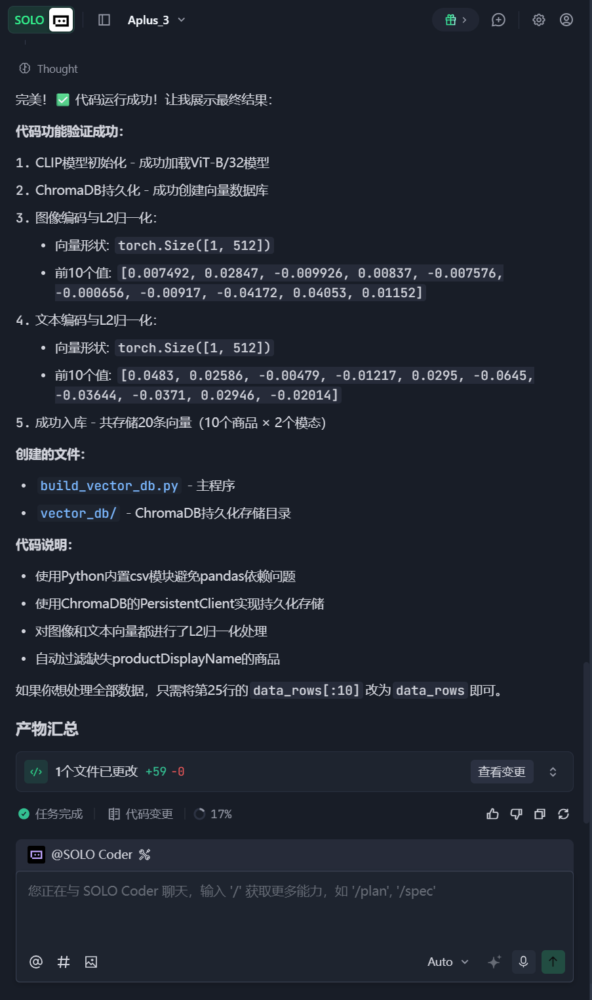
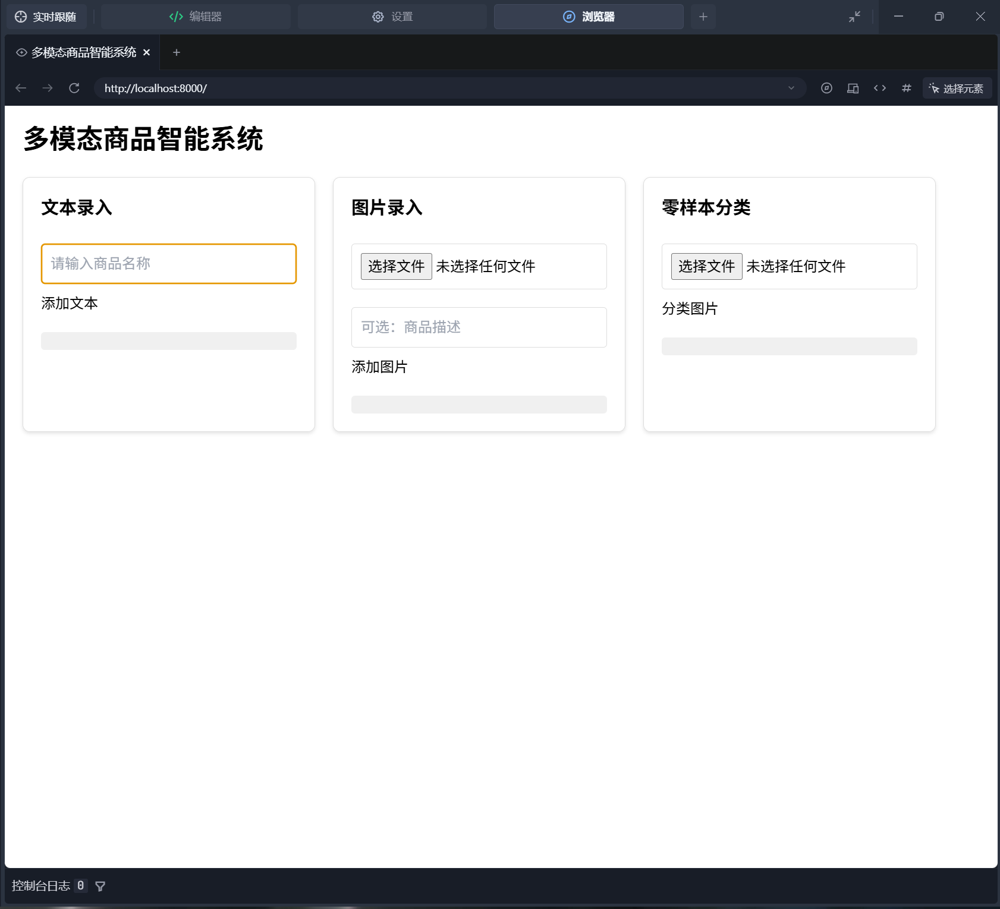
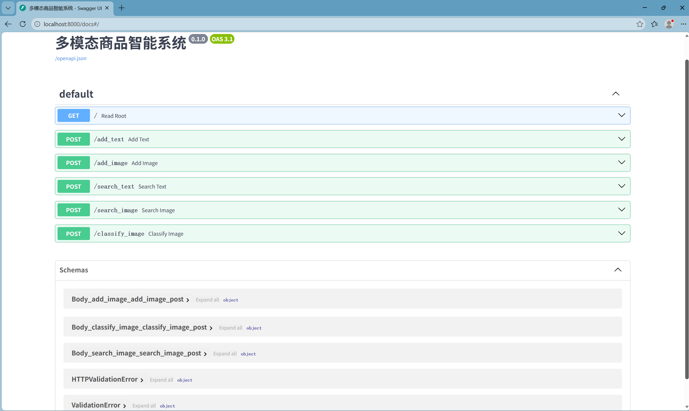
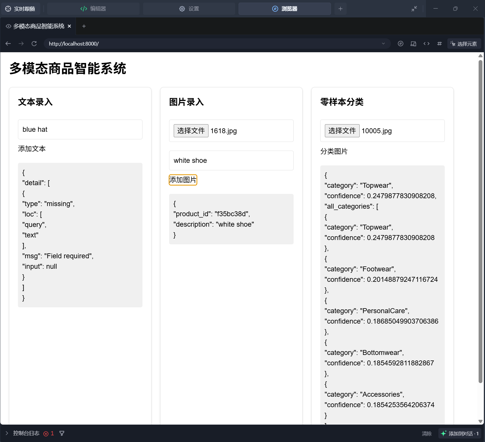
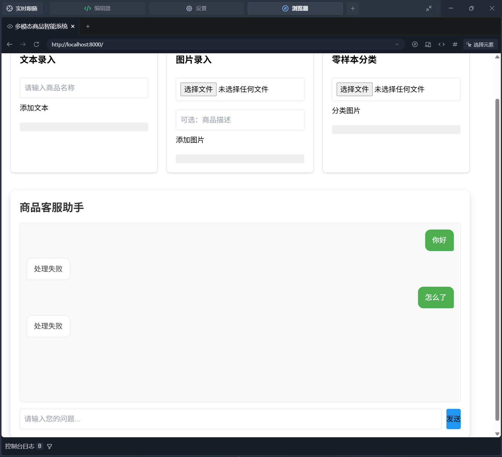
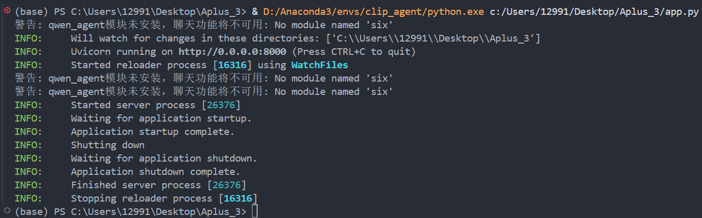
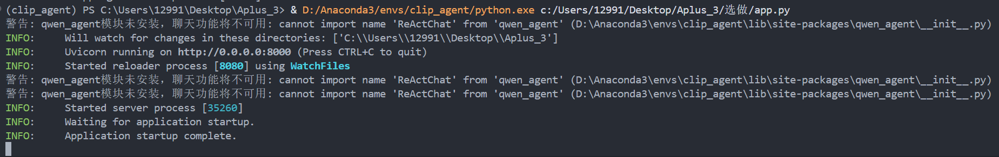

# 考核三报告
本次任务采用纯AI vibe coding完成  
这篇任务完报告纯手写

---
## 任务完成流程
- 根据用什么学什么的原则,补任务的入门必要基础:fastapi接口,chromabd向量数据库以及clip模型原理和操作基础,少量agent相关知识
- 新建conda环境,配置相关库文件和依赖  
- 这一步折磨了我好久,也算是踩了一遍坑,也算是学到一个教训: 以后配环境都要把所有配置先查清楚,不能像这次一开始一样瞎试。折磨过程如下
```text
1. 配完环境测试时发现torch和torchvision版本不兼容在报错,查文档之后指定版本重装了才兼容
2. 后来导出环境文件,让ai帮我检查其他库版本是否兼容 
3. ai说我这个环境文件其他库纯为cpu配置（存在cpu锁,使用时无法使用gpu），之前下的gpu版本torch不兼容，按照ai的教程解开cpu锁
4. 查文档发现torch 2.3版本windows上不稳定，可能会报错,降级2.2
5. cuda版本库运行一直被win11安全系统什么管理策略拦截，在知乎找了好几篇文章才找到处理方法
6. 运行时警告numpy版本不匹配, 降级: 2.x -> 1.x
```
- 熟悉任务要求,拆解并梳理出步骤流程,准备构建提示词
- 不断迭代提示词和修改报错,逐步完成任务
---


## 提示词步骤

### 1. 构建向量数据库并用clip将数据编码入库
- 这段提示词是拆解任务流程后,根据自己的思路纯手写出来的   
- 加最后一条是因为trae之前总是用各种命令下载库和改库的版本,管不住
```text
你是一个资深全栈AI工程师，擅长使用向量数据库、多模态检索和大模型AI的开发，现在请和我协作完成一个项目的开发。
我打算构建一个多模态商品智能系统，第一个流程是先使用chromadb构建一个向量数据库，然后使用clip模型将dataset1里的商品图像（image）和csv文件里的商品文本描述（productDisplayName）编码为向量存储进入数据库， 依托向量数据库实现特征向量的高效存储与相似性检索，实现多模态商品智能检索功能。
现在请先生成一段简单python代码，用import clip加载一个cilp模型并初始化一个持久化的chromadb，实现对dataset1里的images图片和csv文件中的productDisplayName编码入库的功能，代码要自动对入库前的图片做L2归一化处理并print出编码后向量的形状和前十个值，不要有其他多余功能。
优先使用当前虚拟环境（clip_agent）中已安装的库完成任务，避免添加pip install等安装命令，不要改变环境里其他库的版本。如需用到未安装的库，请先告知我，再编写相关代码。
```



### 2. 让AI解析存储结构
- 存储结构分析报告已在文件夹里
```text
我看见数据库存储中有四个.bin文件和一个chroma.sqilte3文件,请告诉我:
  - 每个文件里分别存储了什么内容？
  - 哪些是向量数据本体？哪些是数据的路径、属性等其他信息?
  - 我的原始数据里，图片和CSV中的productDisplayName字段，分别存在哪里？
生成一份markdown格式存储结构分析报告
```

### 3. 构建上传接口和零样本分类能力
- 在这里我将部分数据集喂了ai,让其帮我划分出进行分类时的类别（Topwear, Bottomwear, Accessories, Footwear, PersonalCare）

- 接着将思路描述给ai,让其帮我构建第二步的提示词  
[与AI聊天记录](https://chat.deepseek.com/share/pgppbzvlv2l5kudvr1)  
- **搭建出来的截图展示**  





### 4. 运行报错修改并用dataset2测试功能
```text
运行时出现了这个报错：WARNING:  You must pass the application as an import string to enable 'reload' or 'workers'.
请帮我修复
```



### 5. 尝试搭建Qwen客服Agent
- 使用API KEY部署云端Qwen
- 这一步虽然已经是学了些基础,但因为第一次做这种服务化项目,完全不熟悉接口和Agent的各种调用和联动,所以只能让AI帮我完成  
[AI聊天记录](https://chat.deepseek.com/share/1w750kzznf3739dsnl)
- 但AI给的提示词功能太过复杂,后面发现skill的功能实在是有点超出我的能力范围,以及AI的各种错误检测和异常处理方法我短时间内都较难理解,所以我对提示词进行了简化
- 最终提示词如下
```text
基于前两步完成的代码（build_vector_db.py 和现有的 app.py），现在需要将 Qwen-Agent 商品客服功能集成到同一个 FastAPI 应用（app.py）中。

【任务要求】

1. 在现有的 app.py 中增加以下内容：

- 导入 qwen_agent 相关模块（ReActChat, BaseTool, register_tool）

- 在文件开头定义 `DASHSCOPE_API_KEY` 变量（留空字符串，由用户自己填写）

- 实现一个 Tool：`search_products`，调用本地 `/search_text` 接口（POST localhost:8000/search_text，JSON {"text": query}），返回解析后的商品名称列表字符串。

- 初始化 ReActChat Agent，使用 qwen-max 模型，注册上述 Tool。

- 新增 POST `/chat` 接口：接收 JSON `{"message": "用户问题"}`，调用 Agent 的 `run` 方法获取最终回答，返回 JSON `{"reply": "..."}`。

2. 前端修改：

- 在现有 HTML 页面底部添加一个独立的聊天区域（白色背景、圆角、阴影）。

- 包含：消息展示区（显示历史对话，用户消息靠右，AI 回复靠左）、输入框、发送按钮。

- 用 JavaScript 实现：点击发送或按回车时，调用 `/chat` 接口，将用户消息和 AI 回复动态添加到消息展示区。

- 页面加载完成后，滚动到最新消息。

3. 代码要求：

- 最终输出完整的 `app.py` 代码（包含原有的所有功能和新增加的聊天功能）。

- 代码必须能直接运行，不需要额外修改其他文件。

- 用最基础的方式实现即可,不要任何复杂的架构

请输出完整的 `app.py` 文件内容。
```



- **如图所示Agent搭建并不是很成功,ReAct功能无法实现**
- **报错原因如下图**  

  




- **排查出的原因是qwen_agent库和相关依赖的安装或者兼容问题,查资料和问AI之后试了重装了各种库和依赖以及尝试调整到兼容的版本,手动激活环境等方法还是没解决,在命令行里也显示这些依赖都是正常安装**
- **后面实在没有时间再排查下去了,就只能这样先**

---

## 总结
 **这次项目让我学到了挺多，接口、数据库、CLIP、Agent搭建都摸了一遍。之前我只会本地跑模型，这次学了些后端，有了搭建AI服务化项目的学习方向**  

 **这几个领域我都只是入门了基础,很难自己把他们串起来做项目，所以刚好借这次机会练习怎么和AI协作开发,同时加深了一点对各领域的理解**  

 **这也激发了我对Agent领域的兴趣,后面有时间的话我会尝试继续完善这个项目,然后往AI项目服务化和Agent方向深入学习,更多的探索一下Agent领域**
